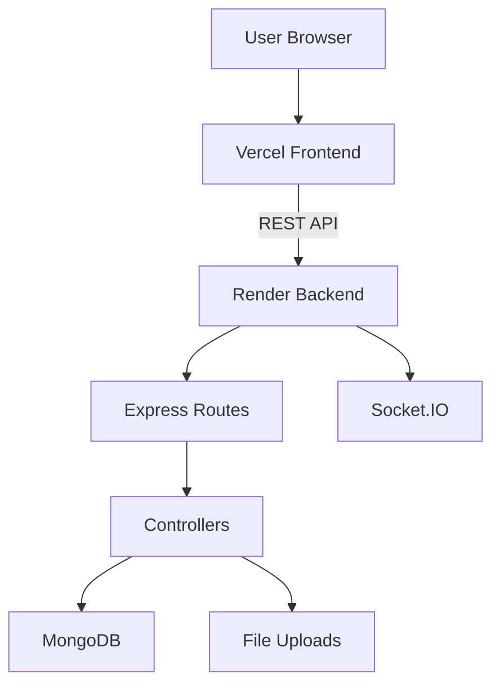

# Gradion — Automated Academic Evaluation Suite

Gradion is a full-stack academic evaluation platform for managing classes, assignments, submissions, and role-based dashboards for teachers and students.

## Overview

This project demonstrates a complete client-server application with:
- `Node.js` + `Express` backend
- `MongoDB` + `Mongoose` database layer
- JWT authentication and role-based access control
- REST API design and modular MVC-style structure
- Frontend deployment on Vercel and backend deployment on Render
- Real-time-ready architecture with Socket.IO support

## Problem Statement

Manual assignment handling is slow, difficult to track, and hard to scale across classes. Gradion simplifies this by providing:
- centralized assignment creation
- student submission tracking
- class and dashboard management
- secure login and authorization
- deployment-friendly separation of frontend and backend

## Objectives

- Build a clean MVC-style backend
- Support student and teacher roles
- Store academic data securely in MongoDB
- Expose stable REST endpoints for the frontend
- Demonstrate deployment and production-readiness

## Key Features

### Authentication and Authorization
- Register and login for `student` and `teacher`
- JWT-based authentication
- protected routes using middleware
- logout and token refresh support

### Academic Workflow
- teacher dashboard
- student dashboard
- class management
- assignment creation and viewing
- submission workflow
- profile management

### Security and Backend Practices
- `helmet` security headers
- rate limiting
- XSS and input sanitization
- file upload handling
- structured logging

### Real-Time Ready
- Socket.IO initializer included
- room-based architecture ready for notifications and live updates

## Tech Stack

| Layer | Technology |
|---|---|
| Frontend | React, Vite, React Router |
| Backend | Node.js, Express |
| Database | MongoDB, Mongoose |
| Auth | JWT, bcryptjs |
| Security | Helmet, rate limiter, sanitizers |
| Realtime | Socket.IO |
| Deployment | Vercel, Render |

## Architecture



## Project Structure

```text
Gradion/
├── backend/
│   ├── config/
│   ├── controllers/
│   ├── middleware/
│   ├── models/
│   ├── routes/
│   ├── uploads/
│   ├── utils/
│   ├── views/
│   ├── server.js
│   └── socket.js
├── frontend/
│   ├── src/
│   ├── public/
│   ├── vite.config.js
│   └── vercel.json
└── README.md
```

## Evaluation Criteria Mapping

### 1) Presentation
- clear project title and overview
- understandable architecture diagram
- feature summary and technology stack
- deployment and workflow notes

### 2) File Work
- modular folders for routes, controllers, models, middleware, and utils
- clean project structure
- environment config support
- deployment files such as `vercel.json`

### 3) Project Work and Viva
- authentication flow
- role-based dashboard handling
- assignment and submission workflow
- REST API endpoints
- deployment on Vercel and Render
- Socket.IO-ready backend
- security middleware and logging

## API Highlights

### Health and Root
- `GET /` → API info
- `GET /api` → API summary
- `GET /api/health` → health check

### Auth
- `POST /api/auth/register`
- `POST /api/auth/login`
- `GET /api/auth/verify`
- `POST /api/auth/logout`
- `POST /api/auth/refresh`

### Core Modules
- assignments
- classes
- dashboard
- submissions
- profile
- mailbox

## Environment Variables

### Backend (`backend/.env`)

```env
MONGODB_URI=your_mongodb_connection_string
JWT_SECRET=your_jwt_secret
PORT=5000
GEMINI_API_KEY=your_gemini_api_key
GEMINI_MODEL=gemini-2.5-flash
ALLOWED_ORIGINS=https://your-frontend.vercel.app
TRUST_PROXY=true
```

### Frontend (`frontend/.env`)

```env
VITE_API_BASE_URL=https://your-backend.onrender.com
VITE_SOCKET_URL=https://your-backend.onrender.com
```

## Local Development

### Backend

```bash
cd backend
npm install
npm run dev
```

### Frontend

```bash
cd frontend
npm install
npm run dev
```

## Deployment Guide

### Backend on Render

1. Create a Render Web Service
2. Set root directory to `backend`
3. Build command: `npm install`
4. Start command: `npm start`
5. Add environment variables:
   - `MONGODB_URI`
   - `JWT_SECRET`
   - `GEMINI_API_KEY`
   - `GEMINI_MODEL`
   - `ALLOWED_ORIGINS`
   - `TRUST_PROXY=true`

### Frontend on Vercel

1. Import the repository into Vercel
2. Set root directory to `frontend`
3. Build command: `npm run build`
4. Output directory: `dist`
5. Add environment variables:
   - `VITE_API_BASE_URL=https://your-backend.onrender.com`
   - `VITE_SOCKET_URL=https://your-backend.onrender.com`
6. Ensure [frontend/vercel.json](frontend/vercel.json) is included for SPA refresh support

## Testing

### Health Check

```bash
curl https://your-backend.onrender.com/api/health
```

### Login Test

```bash
$tmp = Join-Path $env:TEMP 'gradion-login.json'
'{"email":"chetna@gradion.com","password":"chetna123"}' | Set-Content -NoNewline -Encoding utf8 $tmp
curl.exe -i -X POST "https://your-backend.onrender.com/api/auth/login" -H "Content-Type: application/json" --data-binary "@$tmp"
```

### Build Check

```bash
cd frontend
npm run build
```

## Notes for Viva

- Frontend and backend are deployed separately
- API calls go from Vercel frontend to Render backend
- Browser refresh on routes is handled by SPA rewrite
- CORS is controlled using `ALLOWED_ORIGINS`
- Security is handled using middleware and sanitization

## Future Enhancements

- unit tests for auth and submissions
- Swagger/OpenAPI docs
- file storage with Cloudinary or S3
- plagiarism detection
- live notifications using Socket.IO rooms

## Team

- Rishabh — backend, auth, deployment
- other contributors — frontend and academic workflow modules

## License

Academic project for evaluation purposes.