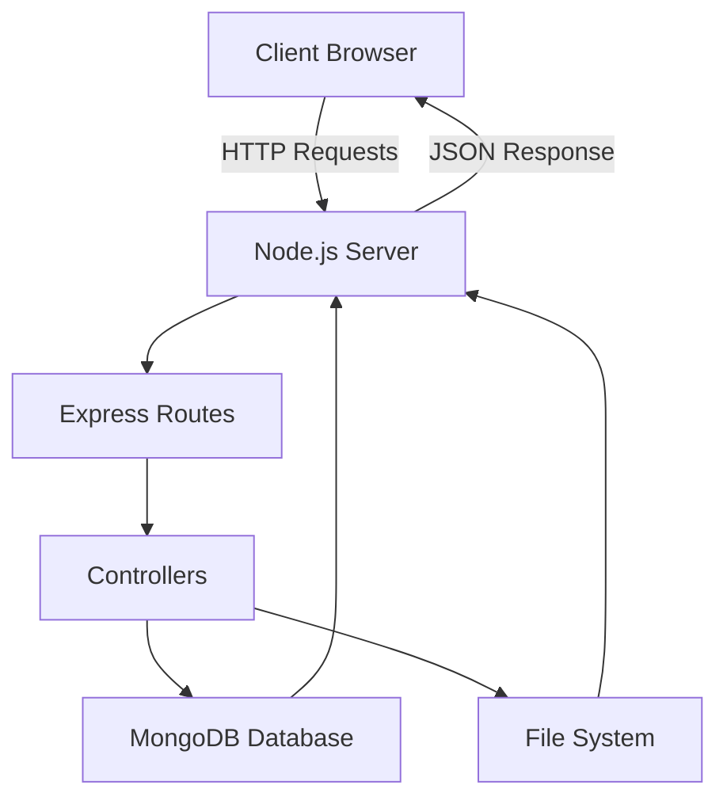

# 🚀 Gradion – Automated Academic Evaluation Suite

<p align="center">
An intelligent backend-driven platform for managing programming assignments, submissions, and academic evaluation workflows.
</p>

<p align="center">


</p>

---

## 📌 Overview

**Gradion** is a backend-focused academic platform designed to streamline the creation, submission, and management of programming assignments in educational environments.

The system enables **role-based interaction between teachers and students**, while maintaining a modular and scalable backend architecture built with **Node.js, Express, and MongoDB**.

The project demonstrates key backend engineering concepts including:

- Client–Server Architecture  
- REST API Design  
- Authentication & Authorization  
- Modular Backend Structure  
- Database Integration  
- File Handling in Node.js  

---

## ✨ Key Features

🔐 **User Authentication**
- Secure login and registration
- JWT-based authentication
- Role-based access (Teacher / Student)

📝 **Assignment Management**
- Teachers create and manage assignments
- Retrieve assignment details
- Assignment listing for students

💻 **Code Submission System**
- Students submit solutions
- Submission timestamps recorded
- Code storage and file handling

⚙ **Backend Architecture**
- RESTful API structure
- Express.js routing and middleware
- Modular controller-based architecture

📂 **File Handling**
- Save submitted code files
- File streaming with Node.js `fs` module

---

## 🛠 Technology Stack

| Layer | Technology |
|------|-------------|
| Backend | Node.js |
| Framework | Express.js |
| Database | MongoDB |
| Authentication | JWT |
| Security | bcrypt |
| Frontend | HTML / CSS / JavaScript |
| Tools | Git, GitHub, Postman |

---

## 🧠 System Architecture



---

## 📁 Project Structure

```
gradion/
│
├── config/        # Database configuration
├── controllers/   # Business logic
├── middleware/    # Authentication & error handling
├── models/        # Database schemas
├── routes/        # API route definitions
├── utils/         # Utility functions
├── public/        # Frontend assets
│
├── server.js      # Main Express server
└── basicServer.js # Demonstration HTTP server
```

---

## ⚙ Environment Configuration

Create a `.env` file in the root directory.

```
PORT=5000
MONGO_URI=your_mongodb_connection_string
JWT_SECRET=your_secret_key
```

---

## 🚀 Installation

Clone the repository

```bash
git clone https://github.com/yourusername/gradion.git
cd gradion
```

Install dependencies

```bash
npm install
```

Run the server

```bash
node server.js
```

---

## 🔄 Development Workflow

The project follows a **branch-based development model**.

| Branch | Purpose |
|------|---------|
| auth-core | Authentication & server setup |
| assignment-module | Assignment management |
| submission-module | Submission system |
| frontend-module | Frontend integration |

Typical workflow:

1️⃣ Create feature branch  
2️⃣ Implement module  
3️⃣ Commit changes  
4️⃣ Push to GitHub  
5️⃣ Create Pull Request  
6️⃣ Review & merge to `main`

---

## 🎓 Academic Implementation

This project demonstrates practical implementation of:

- Client–Server Architecture
- HTTP Request Handling
- Express Framework Routing
- Middleware Implementation
- MongoDB Integration
- File Handling
- Exception & Error Handling

---

## 👨‍💻 Team

| Member | Responsibility |
|------|----------------|
| **Rishabh** | Backend Architecture & Authentication |
| **Ridhi** | Assignment Management |
| **Reyan** | Frontend & Backend Integration |
| **Rohan** | Submission & File Handling |

---

## 🔮 Future Enhancements

Planned improvements include:

- AI-based assignment generation
- Automated code execution
- Plagiarism detection
- Code quality analysis
- Instructor analytics dashboard

---

<p align="center">
Built with ❤️
</p>
